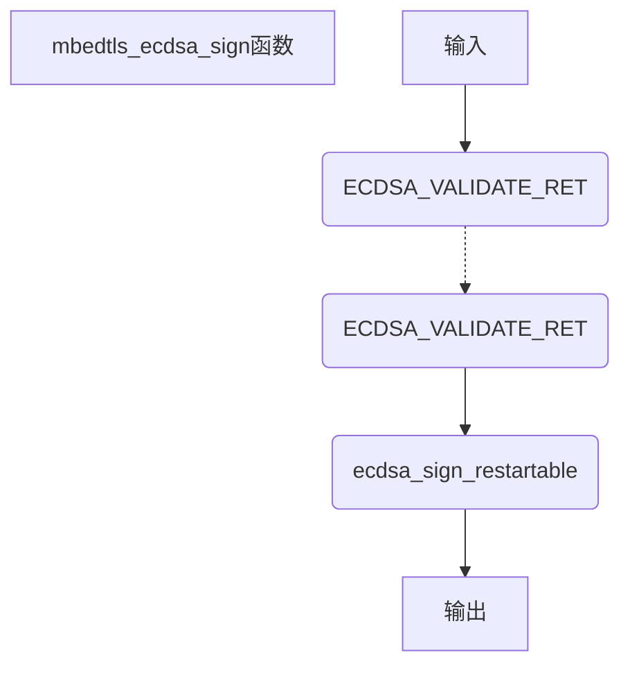

# 入口函数：mbedtls_ecdsa_sign（ecdsa.c 384）

## 函数输入

grp：椭圆曲线群指针

r、s：用于存储签名结果

d：ECDSA私钥

buf：此处输入为消息msg的哈希值

blen：哈希值长度

f_rng： 随机数生成函数

p_rng：伪随机数生成器上下文

## 函数输出

函数返回一个状态值，表示成功或失败

同时生成签名r和s

## 函数流程

***点击流程图跳转对应函数***



## 函数代码

```c
int mbedtls_ecdsa_sign( mbedtls_ecp_group *grp, mbedtls_mpi *r, mbedtls_mpi *s,
                const mbedtls_mpi *d, const unsigned char *buf, size_t blen,
                int (*f_rng)(void *, unsigned char *, size_t), void *p_rng )
{
    ECDSA_VALIDATE_RET( grp   != NULL );
    ECDSA_VALIDATE_RET( r     != NULL );
    ECDSA_VALIDATE_RET( s     != NULL );
    ECDSA_VALIDATE_RET( d     != NULL );
    ECDSA_VALIDATE_RET( f_rng != NULL );
    ECDSA_VALIDATE_RET( buf   != NULL || blen == 0 );

    return( ecdsa_sign_restartable( grp, r, s, d, buf, blen,
                                    f_rng, p_rng, NULL ) );
}
```

## 函数说明

1.首先使用ECDSA_VALIDATE_RET函数检查各个参数是否合法，然而这里的ECDSA_VALIDATE_RET函数实则调用

```
#define MBEDTLS_INTERNAL_VALIDATE_RET( cond, ret )  do { } while( 0 )
```

并没有任何功能。

2.将参数传递给ecdsa_sign_restartable函数进一步执行。这个函数相当于默认不开启restartable模式的签名函数。