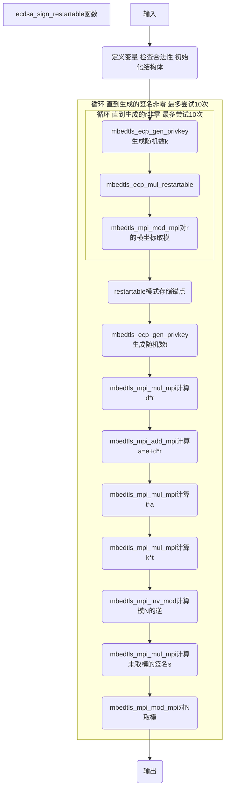

# restartable入口函数：ecdsa_sign_restartable（ecdsa.c 253）

## 函数输入

grp：椭圆曲线群指针

r、s：用于存储签名结果

d：ECDSA私钥

buf：此处输入为消息msg的哈希值

blen：哈希值长度

f_rng： 随机数生成函数

p_rng：伪随机数生成器上下文

restartable: 可以控制是否开启restartable模式，如果为NULL则关闭，如果提供对应的上下文可以开启，支持中断和继续执行。

## 函数输出

函数返回一个状态值，表示成功或失败

同时生成签名r和s

## 函数流程

***点击流程图跳转对应函数***



## 函数代码

```c
static int ecdsa_sign_restartable( mbedtls_ecp_group *grp,
                mbedtls_mpi *r, mbedtls_mpi *s,
                const mbedtls_mpi *d, const unsigned char *buf, size_t blen,
                int (*f_rng)(void *, unsigned char *, size_t), void *p_rng,
                mbedtls_ecdsa_restart_ctx *rs_ctx )
{
    int ret, key_tries, sign_tries;
    int *p_sign_tries = &sign_tries, *p_key_tries = &key_tries;
    mbedtls_ecp_point R;
    mbedtls_mpi k, e, t;
    mbedtls_mpi *pk = &k, *pr = r;

    /* Fail cleanly on curves such as Curve25519 that can't be used for ECDSA */
    if( grp->N.p == NULL )
        return( MBEDTLS_ERR_ECP_BAD_INPUT_DATA );

    /* Make sure d is in range 1..n-1 */
    if( mbedtls_mpi_cmp_int( d, 1 ) < 0 || mbedtls_mpi_cmp_mpi( d, &grp->N ) >= 0 )
        return( MBEDTLS_ERR_ECP_INVALID_KEY );

    mbedtls_ecp_point_init( &R );
    mbedtls_mpi_init( &k ); mbedtls_mpi_init( &e ); mbedtls_mpi_init( &t );

    ECDSA_RS_ENTER( sig );

#if defined(MBEDTLS_ECP_RESTARTABLE)
    if( rs_ctx != NULL && rs_ctx->sig != NULL )
    {
        /* redirect to our context */
        p_sign_tries = &rs_ctx->sig->sign_tries;
        p_key_tries = &rs_ctx->sig->key_tries;
        pk = &rs_ctx->sig->k;
        pr = &rs_ctx->sig->r;

        /* jump to current step */
        if( rs_ctx->sig->state == ecdsa_sig_mul )
            goto mul;
        if( rs_ctx->sig->state == ecdsa_sig_modn )
            goto modn;
    }
#endif /* MBEDTLS_ECP_RESTARTABLE */

    *p_sign_tries = 0;
    do
    {
        if( *p_sign_tries++ > 10 )
        {
            ret = MBEDTLS_ERR_ECP_RANDOM_FAILED;
            goto cleanup;
        }

        /*
         * Steps 1-3: generate a suitable ephemeral keypair
         * and set r = xR mod n
         */
        *p_key_tries = 0;
        do
        {
            if( *p_key_tries++ > 10 )
            {
                ret = MBEDTLS_ERR_ECP_RANDOM_FAILED;
                goto cleanup;
            }

            MBEDTLS_MPI_CHK( mbedtls_ecp_gen_privkey( grp, pk, f_rng, p_rng ) );

#if defined(MBEDTLS_ECP_RESTARTABLE)
            if( rs_ctx != NULL && rs_ctx->sig != NULL )
                rs_ctx->sig->state = ecdsa_sig_mul;

mul:
#endif
            MBEDTLS_MPI_CHK( mbedtls_ecp_mul_restartable( grp, &R, pk, &grp->G,
                                                  f_rng, p_rng, ECDSA_RS_ECP ) );
            MBEDTLS_MPI_CHK( mbedtls_mpi_mod_mpi( pr, &R.X, &grp->N ) );
        }
        while( mbedtls_mpi_cmp_int( pr, 0 ) == 0 );

#if defined(MBEDTLS_ECP_RESTARTABLE)
        if( rs_ctx != NULL && rs_ctx->sig != NULL )
            rs_ctx->sig->state = ecdsa_sig_modn;

modn:
#endif
        /*
         * Accounting for everything up to the end of the loop
         * (step 6, but checking now avoids saving e and t)
         */
        ECDSA_BUDGET( MBEDTLS_ECP_OPS_INV + 4 );

        /*
         * Step 5: derive MPI from hashed message
         */
        MBEDTLS_MPI_CHK( derive_mpi( grp, &e, buf, blen ) );

        /*
         * Generate a random value to blind inv_mod in next step,
         * avoiding a potential timing leak.
         */
        MBEDTLS_MPI_CHK( mbedtls_ecp_gen_privkey( grp, &t, f_rng, p_rng ) );

        /*
         * Step 6: compute s = (e + r * d) / k = t (e + rd) / (kt) mod n
         */
        MBEDTLS_MPI_CHK( mbedtls_mpi_mul_mpi( s, pr, d ) );
        MBEDTLS_MPI_CHK( mbedtls_mpi_add_mpi( &e, &e, s ) );
        MBEDTLS_MPI_CHK( mbedtls_mpi_mul_mpi( &e, &e, &t ) );
        MBEDTLS_MPI_CHK( mbedtls_mpi_mul_mpi( pk, pk, &t ) );
        MBEDTLS_MPI_CHK( mbedtls_mpi_inv_mod( s, pk, &grp->N ) );
        MBEDTLS_MPI_CHK( mbedtls_mpi_mul_mpi( s, s, &e ) );
        MBEDTLS_MPI_CHK( mbedtls_mpi_mod_mpi( s, s, &grp->N ) );
    }
    while( mbedtls_mpi_cmp_int( s, 0 ) == 0 );

#if defined(MBEDTLS_ECP_RESTARTABLE)
    if( rs_ctx != NULL && rs_ctx->sig != NULL )
        mbedtls_mpi_copy( r, pr );
#endif

cleanup:
    mbedtls_ecp_point_free( &R );
    mbedtls_mpi_free( &k ); mbedtls_mpi_free( &e ); mbedtls_mpi_free( &t );

    ECDSA_RS_LEAVE( sig );

    return( ret );
}
```

## 函数说明

进行ECDSA签名


**对照ECDSA签名流程：**

**第一步**，生成随机的k

**第二步**，计算R=k*G，G为基点。令r=R.x，为R的横坐标

**第三步**，计算z=H(msg)

**第四步**，计算s=(z+r*d)/k (modN)

最后得到**签名（r,s）**


**代码分析：顺序分析函数功能**

1.定义变量，其中R、k、r与上面流程中的对应变量相对应

sign_tries等变量定义了尝试次数上限

```c
	int ret, key_tries, sign_tries;
    int *p_sign_tries = &sign_tries, *p_key_tries = &key_tries;
    mbedtls_ecp_point R;
    mbedtls_mpi k, e, t;
    mbedtls_mpi *pk = &k, *pr = r;
```

2.检查变量是否合法，检查了椭圆曲线是否可以用于ECDSA，私钥d是否在1到n-1的合法范围内

```c
    /* Fail cleanly on curves such as Curve25519 that can't be used for ECDSA */
    if( grp->N.p == NULL )
        return( MBEDTLS_ERR_ECP_BAD_INPUT_DATA );

    /* Make sure d is in range 1..n-1 */
    if( mbedtls_mpi_cmp_int( d, 1 ) < 0 || mbedtls_mpi_cmp_mpi( d, &grp->N ) >= 0 )
        return( MBEDTLS_ERR_ECP_INVALID_KEY );
```

3.初始化结构体

```c
    mbedtls_ecp_point_init( &R );
    mbedtls_mpi_init( &k ); mbedtls_mpi_init( &e ); mbedtls_mpi_init( &t );
```

4.restart模式保存上下文

如果函数输入了restart上下文，复原状态，包括尝试次数和已经生成的k和r
之后根据存储的步骤跳转到对应的位置

5.**主体代码-外层循环：**尝试生成签名，如果签名为0则重新生成，最多有10次机会，超过则报错返回

注：mbedtls_mpi_cmp_int函数大于时返回1，小于返回-1，相等返回0

```c
    *p_sign_tries = 0;
    do
    {
        if( *p_sign_tries++ > 10 )
        {
            ret = MBEDTLS_ERR_ECP_RANDOM_FAILED;
            goto cleanup;
        }

        ...
    }
    while( mbedtls_mpi_cmp_int( s, 0 ) == 0 );
```

6.**主体代码-循环体第一部分：**生成k和对应的r

类似地，尝试最多10次，直到生成的r（代码中的pr）非零

其中MBEDTLS_MPI_CHK（f）函数检查括号内函数f的返回值，如果返回值非零（正常执行时返回0），则报错返回，不影响f函数的执行

循环内首先调用了mbedtls_ecp_gen_privkey函数，这个函数用来生成指定长度的随机数，既可以生成ECDSA的私钥，也可以在这里用于签名的随机数k（代码中的pk），使用随机数生成函数和伪随机数生成上下文生成随机数。

生成了随机的k，这里如果开启了restart模式，则进行状态存储rs_ctx->sig->state = ecdsa_sig_mul，同时断点继续执行时也从这一句下面的mul：后开始执行

之后调用mbedtls_ecp_mul_restartable函数计算R=k*G

最后调用mbedtls_mpi_mod_mpi函数将R的横坐标对N取模

```c
        *p_key_tries = 0;
        do
        {
            if( *p_key_tries++ > 10 )
            {
                ret = MBEDTLS_ERR_ECP_RANDOM_FAILED;
                goto cleanup;
            }

            MBEDTLS_MPI_CHK( mbedtls_ecp_gen_privkey( grp, pk, f_rng, p_rng ) );

#if defined(MBEDTLS_ECP_RESTARTABLE)
            if( rs_ctx != NULL && rs_ctx->sig != NULL )
                rs_ctx->sig->state = ecdsa_sig_mul;

mul:
#endif
            MBEDTLS_MPI_CHK( mbedtls_ecp_mul_restartable( grp, &R, pk, &grp->G,
                                                  f_rng, p_rng, ECDSA_RS_ECP ) );
            MBEDTLS_MPI_CHK( mbedtls_mpi_mod_mpi( pr, &R.X, &grp->N ) );
        }
	while( mbedtls_mpi_cmp_int( pr, 0 ) == 0 );
```

7.**主体代码-循环体第二部分：**这里如果开启了restart模式，则进行状态存储rs_ctx->sig->state = ecdsa_sig_modn，同时断点继续执行时也从这一句下面的modn：后开始执行

```c
#if defined(MBEDTLS_ECP_RESTARTABLE)
        if( rs_ctx != NULL && rs_ctx->sig != NULL )
            rs_ctx->sig->state = ecdsa_sig_modn;

modn:
```

8.**主体代码-循环体第三部分**：计算另一部分签名s

ECDSA_BUDGET为一个空的宏，没有作用

```c
#define ECDSA_BUDGET( ops )   /* no-op; for compatibility */
```

之后的derive_mpi从预先生成的哈希buf生成一个大整数

mbedtls_ecp_gen_privkey与之前相同，生成一个随机的t

t的作用：为了避免使用相同的随机数而导致私钥泄露，需要使用一个称为“签名盲化因子”（blinding factor）的随机数来盲化签名过程。在上述代码中，t 就是一个签名盲化因子，它是通过调用 mbedtls_ecp_gen_privkey 函数生成的一个随机数。生成随机数的过程是为了防止使用相同的随机数进行签名而导致私钥泄露，因为此时攻击者可能会通过多次观察签名结果来计算出私钥。

之后的一连串计算为计算t (e + rd) / (kt) mod n 的过程

```c
        ECDSA_BUDGET( MBEDTLS_ECP_OPS_INV + 4 );

        /*
         * Step 5: derive MPI from hashed message
         */
        MBEDTLS_MPI_CHK( derive_mpi( grp, &e, buf, blen ) );

        /*
         * Generate a random value to blind inv_mod in next step,
         * avoiding a potential timing leak.
         */
        MBEDTLS_MPI_CHK( mbedtls_ecp_gen_privkey( grp, &t, f_rng, p_rng ) );

        /*
         * Step 6: compute s = (e + r * d) / k = t (e + rd) / (kt) mod n
         */
        MBEDTLS_MPI_CHK( mbedtls_mpi_mul_mpi( s, pr, d ) );
        MBEDTLS_MPI_CHK( mbedtls_mpi_add_mpi( &e, &e, s ) );
        MBEDTLS_MPI_CHK( mbedtls_mpi_mul_mpi( &e, &e, &t ) );
        MBEDTLS_MPI_CHK( mbedtls_mpi_mul_mpi( pk, pk, &t ) );
        MBEDTLS_MPI_CHK( mbedtls_mpi_inv_mod( s, pk, &grp->N ) );
        MBEDTLS_MPI_CHK( mbedtls_mpi_mul_mpi( s, s, &e ) );
        MBEDTLS_MPI_CHK( mbedtls_mpi_mod_mpi( s, s, &grp->N ) );
```

9.函数结尾部分，存储状态、释放空间

```c
#if defined(MBEDTLS_ECP_RESTARTABLE)
    if( rs_ctx != NULL && rs_ctx->sig != NULL )
        mbedtls_mpi_copy( r, pr );
#endif

cleanup:
    mbedtls_ecp_point_free( &R );
    mbedtls_mpi_free( &k ); mbedtls_mpi_free( &e ); mbedtls_mpi_free( &t );

    ECDSA_RS_LEAVE( sig );

    return( ret );
```


