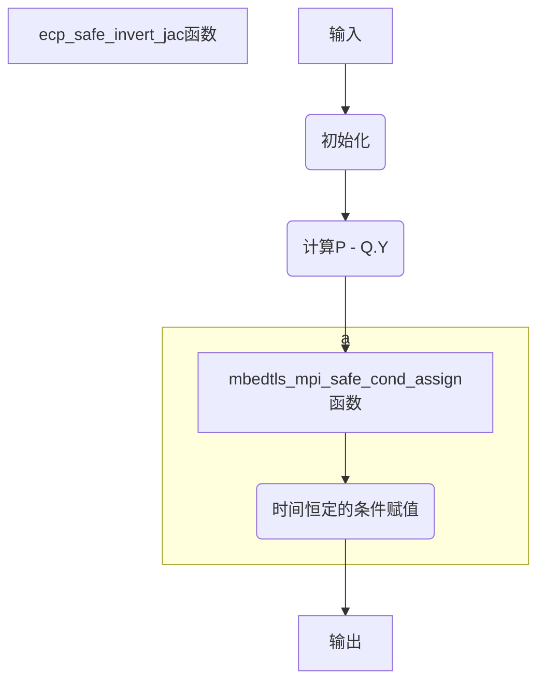

# ecp_safe_invert_jac (ecp.c 1226)

## 函数流程



## 函数代码

```c
static int ecp_safe_invert_jac( const mbedtls_ecp_group *grp,
                            mbedtls_ecp_point *Q,
                            unsigned char inv )
{
    int ret;
    unsigned char nonzero;
    mbedtls_mpi mQY;

    mbedtls_mpi_init( &mQY );

    /* Use the fact that -Q.Y mod P = P - Q.Y unless Q.Y == 0 */
    MBEDTLS_MPI_CHK( mbedtls_mpi_sub_mpi( &mQY, &grp->P, &Q->Y ) );
    nonzero = mbedtls_mpi_cmp_int( &Q->Y, 0 ) != 0;
    MBEDTLS_MPI_CHK( mbedtls_mpi_safe_cond_assign( &Q->Y, &mQY, inv & nonzero ) );

cleanup:
    mbedtls_mpi_free( &mQY );

    return( ret );
}
```

## 函数说明

- 首先，通过调用`mbedtls_mpi_init()`函数对`mQY`进行初始化。
- 接下来，计算`-Q.Y mod P`，即`P - Q.Y`，并将结果存储在`mQY`中。这一步利用了椭圆曲线的性质，即`-Q.Y mod P`等于`P - Q.Y`。
- 然后，判断点`Q`的`Y`坐标是否为非零值，将判断结果存储在`nonzero`中。
- 使用`mbedtls_mpi_safe_cond_assign()`函数根据`inv`和`nonzero`的值来进行条件赋值操作，即如果`inv`为真且`nonzero`为真，则将`mQY`的值赋给`Q->Y`，否则不进行赋值操作。
- 最后，通过调用`mbedtls_mpi_free()`函数释放`mQY`的内存空间。


## mbedtls_mpi_safe_cond_assign（bignum.c 249）函数代码

```c
int mbedtls_mpi_safe_cond_assign( mbedtls_mpi *X, const mbedtls_mpi *Y, unsigned char assign )
{
    int ret = 0;
    size_t i;
    MPI_VALIDATE_RET( X != NULL );
    MPI_VALIDATE_RET( Y != NULL );

    /* make sure assign is 0 or 1 in a time-constant manner */
    assign = (assign | (unsigned char)-assign) >> 7;

    MBEDTLS_MPI_CHK( mbedtls_mpi_grow( X, Y->n ) );

    X->s = X->s * ( 1 - assign ) + Y->s * assign;

    for( i = 0; i < Y->n; i++ )
        X->p[i] = X->p[i] * ( 1 - assign ) + Y->p[i] * assign;

    for( ; i < X->n; i++ )
        X->p[i] *= ( 1 - assign );

cleanup:
    return( ret );
}
```


## mbedtls_mpi_safe_cond_assign函数说明

**条件赋值X=Y，不泄露信息。**

```
assign = (assign | (unsigned char)-assign) >> 7;
```

**这段代码的目的是确保`assign`的值在时间上是恒定的**，并将其限制为0或1。它使用位运算将`assign`与其负值按位或运算，然后右移7位，从而将`assign`的最高有效位移位到最低有效位，得到0或1。

然后，通过调用`mbedtls_mpi_grow`函数，使`X`的大小增长到与`Y->n`相同的长度：

```
MBEDTLS_MPI_CHK(mbedtls_mpi_grow( X, Y->n ));
```

接下来，循环对`X->p[i]`进行条件赋值：

```
for( i = 0; i < Y->n; i++ )
    X->p[i] = X->p[i] * ( 1 - assign ) + Y->p[i] * assign;
```

这段代码根据`assign`的值（0或1），对`X->p[i]`进行条件赋值。如果`assign`为0，则将`X->p[i]`乘以(1 - assign)，即0，然后加上`Y->p[i]`乘以assign，即为0；如果`assign`为1，则将`X->p[i]`乘以(1 - assign)，即为0，然后加上`Y->p[i]`乘以assign，即为`Y->p[i]`。

最后，对于`i`从`Y->n`到`X->n`的范围，将`X->p[i]`乘以(1 - assign)：

```
for( ; i < X->n; i++ )
    X->p[i] *= ( 1 - assign );
```

