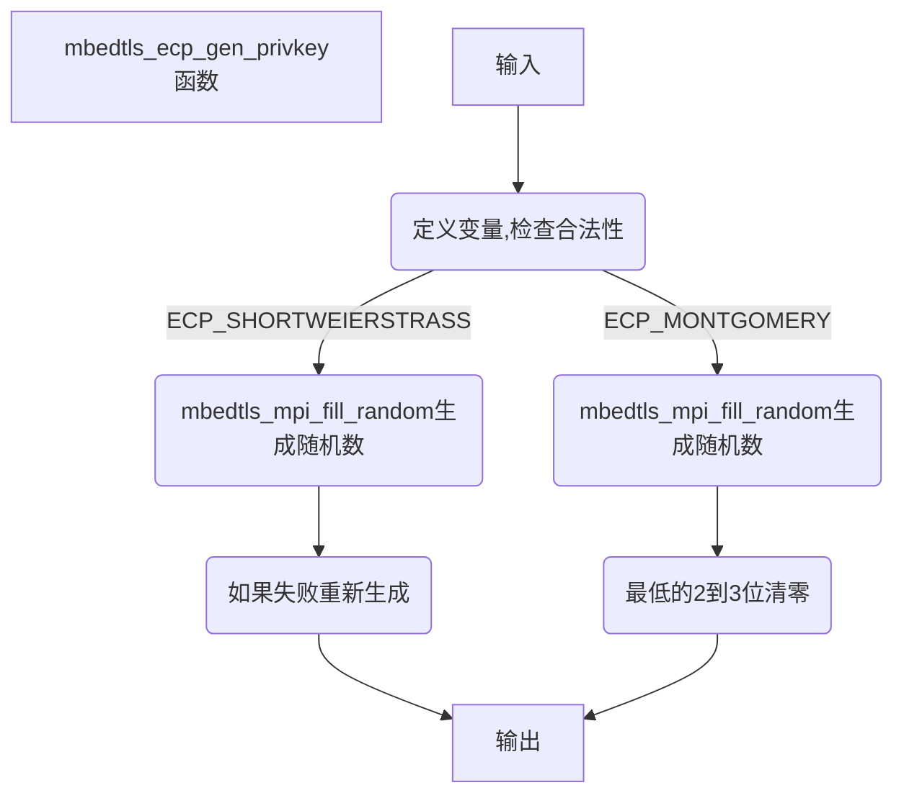

# mbedtls_ecp_gen_privkey(ecp.c 2680)

## 函数流程

***点击流程图跳转对应函数***



## 函数代码

mbedtls_ecp_gen_privkey

```c
int mbedtls_ecp_gen_privkey( const mbedtls_ecp_group *grp,
                     mbedtls_mpi *d,
                     int (*f_rng)(void *, unsigned char *, size_t),
                     void *p_rng )
{
    int ret = MBEDTLS_ERR_ECP_BAD_INPUT_DATA;
    size_t n_size;

    ECP_VALIDATE_RET( grp   != NULL );
    ECP_VALIDATE_RET( d     != NULL );
    ECP_VALIDATE_RET( f_rng != NULL );

    n_size = ( grp->nbits + 7 ) / 8;

#if defined(ECP_MONTGOMERY)
    if( ecp_get_type( grp ) == ECP_TYPE_MONTGOMERY )
    {
        /* [M225] page 5 */
        size_t b;

        do {
            MBEDTLS_MPI_CHK( mbedtls_mpi_fill_random( d, n_size, f_rng, p_rng ) );
        } while( mbedtls_mpi_bitlen( d ) == 0);

        /* Make sure the most significant bit is nbits */
        b = mbedtls_mpi_bitlen( d ) - 1; /* mbedtls_mpi_bitlen is one-based */
        if( b > grp->nbits )
            MBEDTLS_MPI_CHK( mbedtls_mpi_shift_r( d, b - grp->nbits ) );
        else
            MBEDTLS_MPI_CHK( mbedtls_mpi_set_bit( d, grp->nbits, 1 ) );

        /* Make sure the last two bits are unset for Curve448, three bits for
           Curve25519 */
        MBEDTLS_MPI_CHK( mbedtls_mpi_set_bit( d, 0, 0 ) );
        MBEDTLS_MPI_CHK( mbedtls_mpi_set_bit( d, 1, 0 ) );
        if( grp->nbits == 254 )
        {
            MBEDTLS_MPI_CHK( mbedtls_mpi_set_bit( d, 2, 0 ) );
        }
    }
#endif /* ECP_MONTGOMERY */

#if defined(ECP_SHORTWEIERSTRASS)
    if( ecp_get_type( grp ) == ECP_TYPE_SHORT_WEIERSTRASS )
    {
        /* SEC1 3.2.1: Generate d such that 1 <= n < N */
        int count = 0;

        /*
         * Match the procedure given in RFC 6979 (deterministic ECDSA):
         * - use the same byte ordering;
         * - keep the leftmost nbits bits of the generated octet string;
         * - try until result is in the desired range.
         * This also avoids any biais, which is especially important for ECDSA.
         */
        do
        {
            MBEDTLS_MPI_CHK( mbedtls_mpi_fill_random( d, n_size, f_rng, p_rng ) );
            MBEDTLS_MPI_CHK( mbedtls_mpi_shift_r( d, 8 * n_size - grp->nbits ) );

            /*
             * Each try has at worst a probability 1/2 of failing (the msb has
             * a probability 1/2 of being 0, and then the result will be < N),
             * so after 30 tries failure probability is a most 2**(-30).
             *
             * For most curves, 1 try is enough with overwhelming probability,
             * since N starts with a lot of 1s in binary, but some curves
             * such as secp224k1 are actually very close to the worst case.
             */
            if( ++count > 30 )
                return( MBEDTLS_ERR_ECP_RANDOM_FAILED );
        }
        while( mbedtls_mpi_cmp_int( d, 1 ) < 0 ||
               mbedtls_mpi_cmp_mpi( d, &grp->N ) >= 0 );
    }
#endif /* ECP_SHORTWEIERSTRASS */

cleanup:
    return( ret );
}
```


## 函数说明

函数根据不同的曲线类型生成不同的满足要求的随机数

曲线类型包括：

There are several different ways to express elliptic curves over F_p:

- The **short Weierstrass equation** y^2 = x^3 + ax + b, where 4a^3+27b^2 is nonzero in F_p, is an elliptic curve over F_p. Every elliptic curve over F_p can be converted to a short Weierstrass equation if p is larger than 3.
- The **Montgomery equation** By^2 = x^3 + Ax^2 + x, where B(A^2-4) is nonzero in F_p, is an elliptic curve over F_p. Substituting x = Bu-A/3 and y = Bv produces the short Weierstrass equation v^2 = u^3 + au + b where a = (3-A^2)/(3B^2) and b = (2A^3-9A)/(27B^3). Montgomery curves were introduced by [1987 Montgomery](https://safecurves.cr.yp.to/refs.html#1987/montgomery-speeding).
- The **Edwards equation** x^2 + y^2 = 1 + dx^2y^2, where d(1-d) is nonzero in F_p, is an elliptic curve over F_p. Substituting x = u/v and y = (u-1)/(u+1) produces the Montgomery equation Bv^2 = u^3 + Au^2 + u where A = 2(1+d)/(1-d) and B = 4/(1-d). Edwards curves were introduced by [2007 Edwards](https://safecurves.cr.yp.to/refs.html#2007/edwards-normal) in the case that d is a 4th power. SafeCurves requires Edwards curves to be **complete**, i.e., for d to not be a square; complete Edwards curves were introduced by [2007 Bernstein–Lange](https://safecurves.cr.yp.to/refs.html#2007/bernstein-newelliptic).

其中mbedtls支持的是**Montgomery equation** 和**short Weierstrass equation**

函数的核心为mbedtls_mpi_fill_random函数

函数先调用mbedtls_mpi_fill_random函数生成随机数，再根据曲线类型调整

例如如果椭圆曲线类型为 Montgomery，则将最低的2到3位清零

