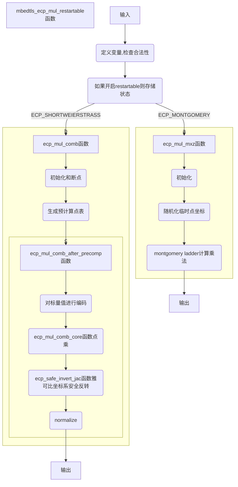

# mbedtls_ecp_mul_restartable（ecp.c 2324）

## 函数流程



## 函数代码

```c
int mbedtls_ecp_mul_restartable( mbedtls_ecp_group *grp, mbedtls_ecp_point *R,
             const mbedtls_mpi *m, const mbedtls_ecp_point *P,
             int (*f_rng)(void *, unsigned char *, size_t), void *p_rng,
             mbedtls_ecp_restart_ctx *rs_ctx )
{
    int ret = MBEDTLS_ERR_ECP_BAD_INPUT_DATA;
#if defined(MBEDTLS_ECP_INTERNAL_ALT)
    char is_grp_capable = 0;
#endif
    ECP_VALIDATE_RET( grp != NULL );
    ECP_VALIDATE_RET( R   != NULL );
    ECP_VALIDATE_RET( m   != NULL );
    ECP_VALIDATE_RET( P   != NULL );

#if defined(MBEDTLS_ECP_RESTARTABLE)
    /* reset ops count for this call if top-level */
    if( rs_ctx != NULL && rs_ctx->depth++ == 0 )
        rs_ctx->ops_done = 0;
#endif

#if defined(MBEDTLS_ECP_INTERNAL_ALT)
    if( ( is_grp_capable = mbedtls_internal_ecp_grp_capable( grp ) ) )
        MBEDTLS_MPI_CHK( mbedtls_internal_ecp_init( grp ) );
#endif /* MBEDTLS_ECP_INTERNAL_ALT */

#if defined(MBEDTLS_ECP_RESTARTABLE)
    /* skip argument check when restarting */
    if( rs_ctx == NULL || rs_ctx->rsm == NULL )
#endif
    {
        /* check_privkey is free */
        MBEDTLS_ECP_BUDGET( MBEDTLS_ECP_OPS_CHK );

        /* Common sanity checks */
        MBEDTLS_MPI_CHK( mbedtls_ecp_check_privkey( grp, m ) );
        MBEDTLS_MPI_CHK( mbedtls_ecp_check_pubkey( grp, P ) );
    }

    ret = MBEDTLS_ERR_ECP_BAD_INPUT_DATA;
#if defined(ECP_MONTGOMERY)
    if( ecp_get_type( grp ) == ECP_TYPE_MONTGOMERY )
        MBEDTLS_MPI_CHK( ecp_mul_mxz( grp, R, m, P, f_rng, p_rng ) );
#endif
#if defined(ECP_SHORTWEIERSTRASS)
    if( ecp_get_type( grp ) == ECP_TYPE_SHORT_WEIERSTRASS )
        MBEDTLS_MPI_CHK( ecp_mul_comb( grp, R, m, P, f_rng, p_rng, rs_ctx ) );
#endif

cleanup:

#if defined(MBEDTLS_ECP_INTERNAL_ALT)
    if( is_grp_capable )
        mbedtls_internal_ecp_free( grp );
#endif /* MBEDTLS_ECP_INTERNAL_ALT */

#if defined(MBEDTLS_ECP_RESTARTABLE)
    if( rs_ctx != NULL )
        rs_ctx->depth--;
#endif

    return( ret );
}
```

## 函数说明

**用于执行椭圆曲线上的乘法操作**

根据曲线分类调用不同的处理函数，如果是montgomery则调用ecp_mul_mxz，反之调用ecp_mul_comb


## ecp_mul_mxz函数代码(ecp.c 2263)

```c
static int ecp_mul_mxz( mbedtls_ecp_group *grp, mbedtls_ecp_point *R,
                        const mbedtls_mpi *m, const mbedtls_ecp_point *P,
                        int (*f_rng)(void *, unsigned char *, size_t),
                        void *p_rng )
{
    int ret;
    size_t i;
    unsigned char b;
    mbedtls_ecp_point RP;
    mbedtls_mpi PX;

    mbedtls_ecp_point_init( &RP ); mbedtls_mpi_init( &PX );

    /* Save PX and read from P before writing to R, in case P == R */
    MBEDTLS_MPI_CHK( mbedtls_mpi_copy( &PX, &P->X ) );
    MBEDTLS_MPI_CHK( mbedtls_ecp_copy( &RP, P ) );

    /* Set R to zero in modified x/z coordinates */
    MBEDTLS_MPI_CHK( mbedtls_mpi_lset( &R->X, 1 ) );
    MBEDTLS_MPI_CHK( mbedtls_mpi_lset( &R->Z, 0 ) );
    mbedtls_mpi_free( &R->Y );

    /* RP.X might be sligtly larger than P, so reduce it */
    MOD_ADD( RP.X );

    /* Randomize coordinates of the starting point */
    if( f_rng != NULL )
        MBEDTLS_MPI_CHK( ecp_randomize_mxz( grp, &RP, f_rng, p_rng ) );

    /* Loop invariant: R = result so far, RP = R + P */
    i = mbedtls_mpi_bitlen( m ); /* one past the (zero-based) most significant bit */
    while( i-- > 0 )
    {
        b = mbedtls_mpi_get_bit( m, i );
        /*
         *  if (b) R = 2R + P else R = 2R,
         * which is:
         *  if (b) double_add( RP, R, RP, R )
         *  else   double_add( R, RP, R, RP )
         * but using safe conditional swaps to avoid leaks
         */
        MBEDTLS_MPI_CHK( mbedtls_mpi_safe_cond_swap( &R->X, &RP.X, b ) );
        MBEDTLS_MPI_CHK( mbedtls_mpi_safe_cond_swap( &R->Z, &RP.Z, b ) );
        MBEDTLS_MPI_CHK( ecp_double_add_mxz( grp, R, &RP, R, &RP, &PX ) );
        MBEDTLS_MPI_CHK( mbedtls_mpi_safe_cond_swap( &R->X, &RP.X, b ) );
        MBEDTLS_MPI_CHK( mbedtls_mpi_safe_cond_swap( &R->Z, &RP.Z, b ) );
    }

    MBEDTLS_MPI_CHK( ecp_normalize_mxz( grp, R ) );

cleanup:
    mbedtls_ecp_point_free( &RP ); mbedtls_mpi_free( &PX );

    return( ret );
}
```

## ecp_mul_mxz函数说明

函数的输入参数包括椭圆曲线群 grp、结果存储点 R、乘数 m、被乘点 P、随机数生成函数 f_rng 和随机数生成器上下文指针 p_rng。

函数首先初始化一些变量和数据结构。然后，函数保存了点 P 的 x 坐标，并将点 P 复制到临时点 RP中，以便在计算过程中保持不变。

接着，函数将点 R 的 x/z 坐标设置为 1 和 0，并释放点 R 的 y 坐标。这是 "Montgomery ladder" 算法的初始化步骤。

然后，函数对临时点 RP 的 x 坐标执行模运算，以确保该值在椭圆曲线的定义域内。

**接下来，函数使用随机数生成函数 f_rng 随机化临时点 RP的 x/z 坐标，从而增加攻击难度。（侧信道保护机制）**

**然后，函数根据乘数 m的二进制表示形式，使用 "Montgomery ladder" 算法来计算点 R的值。(可替换为普通实现)**

Montgomery ladder 算法的基本思想：
将点 P 用 Montgomery representation 表示为 (X1:Z1)，其中 X1 和 Z1 都是整数。
初始化两个点，R0 = (1:0) 和 R1 = (X1:1)。
从 m 的最高位开始，对每一位进行处理：
如果该位为 0，则将 R1 加倍，并将 R0 和 R1 交换。
如果该位为 1，则将 R0 与 R1 相加，并将 R0 和 R1 交换。
返回 R0。

最后，函数对点 `R` 进行归一化，以确保它在椭圆曲线的定义域内。然后，函数释放内存并返回结果。


## ecp_mul_comb函数代码(ecp.c 2001)

```c
static int ecp_mul_comb( mbedtls_ecp_group *grp, mbedtls_ecp_point *R,
                         const mbedtls_mpi *m, const mbedtls_ecp_point *P,
                         int (*f_rng)(void *, unsigned char *, size_t),
                         void *p_rng,
                         mbedtls_ecp_restart_ctx *rs_ctx )
{
    int ret;
    unsigned char w, p_eq_g, i;
    size_t d;
    unsigned char T_size, T_ok;
    mbedtls_ecp_point *T;

    ECP_RS_ENTER( rsm );

    /* Is P the base point ? */
#if MBEDTLS_ECP_FIXED_POINT_OPTIM == 1
    p_eq_g = ( mbedtls_mpi_cmp_mpi( &P->Y, &grp->G.Y ) == 0 &&
               mbedtls_mpi_cmp_mpi( &P->X, &grp->G.X ) == 0 );
#else
    p_eq_g = 0;
#endif

    /* Pick window size and deduce related sizes */
    w = ecp_pick_window_size( grp, p_eq_g );
    T_size = 1U << ( w - 1 );
    d = ( grp->nbits + w - 1 ) / w;

    /* Pre-computed table: do we have it already for the base point? */
    if( p_eq_g && grp->T != NULL )
    {
        /* second pointer to the same table, will be deleted on exit */
        T = grp->T;
        T_ok = 1;
    }
    else
#if defined(MBEDTLS_ECP_RESTARTABLE)
    /* Pre-computed table: do we have one in progress? complete? */
    if( rs_ctx != NULL && rs_ctx->rsm != NULL && rs_ctx->rsm->T != NULL )
    {
        /* transfer ownership of T from rsm to local function */
        T = rs_ctx->rsm->T;
        rs_ctx->rsm->T = NULL;
        rs_ctx->rsm->T_size = 0;

        /* This effectively jumps to the call to mul_comb_after_precomp() */
        T_ok = rs_ctx->rsm->state >= ecp_rsm_comb_core;
    }
    else
#endif
    /* Allocate table if we didn't have any */
    {
        T = mbedtls_calloc( T_size, sizeof( mbedtls_ecp_point ) );
        if( T == NULL )
        {
            ret = MBEDTLS_ERR_ECP_ALLOC_FAILED;
            goto cleanup;
        }

        for( i = 0; i < T_size; i++ )
            mbedtls_ecp_point_init( &T[i] );

        T_ok = 0;
    }

    /* Compute table (or finish computing it) if not done already */
    if( !T_ok )
    {
        MBEDTLS_MPI_CHK( ecp_precompute_comb( grp, T, P, w, d, rs_ctx ) );

        if( p_eq_g )
        {
            /* almost transfer ownership of T to the group, but keep a copy of
             * the pointer to use for calling the next function more easily */
            grp->T = T;
            grp->T_size = T_size;
        }
    }

    /* Actual comb multiplication using precomputed points */
    MBEDTLS_MPI_CHK( ecp_mul_comb_after_precomp( grp, R, m,
                                                 T, T_size, w, d,
                                                 f_rng, p_rng, rs_ctx ) );

cleanup:

    /* does T belong to the group? */
    if( T == grp->T )
        T = NULL;

```

## ecp_mul_comb函数说明

椭圆曲线上的点乘法运算，使用了组合算法（Comb method）来优化计算效率。

1. 首先，函数声明了一些变量和指针，如果开启了restartable则记录断点。
2. 函数检查点 P 是否为基点，即 P 是否与椭圆曲线群的基点 G 相等。如果 `MBEDTLS_ECP_FIXED_POINT_OPTIM` 定义为 1，并且 P 的坐标与 G 的坐标相等，则将 p_eq_g 设置为 1；否则设置为 0。
3. 函数调用 `ecp_pick_window_size` 来选择窗口大小，窗口大小的选择取决于 p_eq_g 的值和椭圆曲线群的参数。窗口大小决定了预计算表的大小。
4. 根据窗口大小计算预计算表的大小，并计算 `d` 的值，`d` 表示标量值的位数除以窗口大小后的结果。
5. 函数根据是否已经存在基点的预计算表来判断是否需要进行预计算表的生成：
   - 如果 p_eq_g 为真且 grp->T 不为空，则直接使用 grp->T 作为预计算表，并将 T_ok 设置为 1。
   - 否则，如果启用了重启功能，并且存在正在进行的预计算表，则将预计算表从 rs_ctx 中转移到本地变量 T 中，并将 T_ok 设置为 1。
   - 否则，分配 T_size 大小的内存用于存储预计算表，并初始化预计算表中的点。
     如果内存分配失败，则返回 `MBEDTLS_ERR_ECP_ALLOC_FAILED` 错误。
6. 如果预计算表不存在或者需要重新计算，调用 `ecp_precompute_comb` 函数生成预计算表。该函数使用组合算法（Comb method）来生成预计算表，提前计算出一系列点的坐标，以用于后续的点乘法运算。生成预计算表的过程可能会涉及到重启功能。
7. 如果 P 是基点，则将 T 的所有权转移到群结构体 grp 中，并将 grp->T 和 grp->T_size 设置为相应的值。
8. 最后，调用 `ecp_mul_comb_after_precomp` 函数执行基于预计算表的点乘法运算。该函数使用预计算表中的点进行点乘法运算，可以大大提高计算效率。运算结果存储在 R 中。
9. 清理阶段，释放预计算表的内存资源，并根据 T 是否属于群结构体 grp 来确定是否将 T 设置为 NULL。

其中核心函数为ecp_mul_comb_after_precomp


## ecp_mul_comb_after_precomp函数代码（ecp.c 1903）

```c
static int ecp_mul_comb_after_precomp( const mbedtls_ecp_group *grp,
                                mbedtls_ecp_point *R,
                                const mbedtls_mpi *m,
                                const mbedtls_ecp_point *T,
                                unsigned char T_size,
                                unsigned char w,
                                size_t d,
                                int (*f_rng)(void *, unsigned char *, size_t),
                                void *p_rng,
                                mbedtls_ecp_restart_ctx *rs_ctx )
{
    int ret;
    unsigned char parity_trick;
    unsigned char k[COMB_MAX_D + 1];
    mbedtls_ecp_point *RR = R;

#if defined(MBEDTLS_ECP_RESTARTABLE)
    if( rs_ctx != NULL && rs_ctx->rsm != NULL )
    {
        RR = &rs_ctx->rsm->R;

        if( rs_ctx->rsm->state == ecp_rsm_final_norm )
            goto final_norm;
    }
#endif

    MBEDTLS_MPI_CHK( ecp_comb_recode_scalar( grp, m, k, d, w,
                                            &parity_trick ) );
    MBEDTLS_MPI_CHK( ecp_mul_comb_core( grp, RR, T, T_size, k, d,
                                        f_rng, p_rng, rs_ctx ) );
    MBEDTLS_MPI_CHK( ecp_safe_invert_jac( grp, RR, parity_trick ) );

#if defined(MBEDTLS_ECP_RESTARTABLE)
    if( rs_ctx != NULL && rs_ctx->rsm != NULL )
        rs_ctx->rsm->state = ecp_rsm_final_norm;

final_norm:
#endif
    MBEDTLS_ECP_BUDGET( MBEDTLS_ECP_OPS_INV );
    MBEDTLS_MPI_CHK( ecp_normalize_jac( grp, RR ) );

#if defined(MBEDTLS_ECP_RESTARTABLE)
    if( rs_ctx != NULL && rs_ctx->rsm != NULL )
        MBEDTLS_MPI_CHK( mbedtls_ecp_copy( R, RR ) );
#endif

cleanup:
    return( ret );
}
```

## ecp_mul_comb_after_precomp函数说明

1. 首先，函数声明了一些变量和指针，如果开启了restartable则记录断点。
2. 调用ecp_comb_recode_scalar函数对标量值进行编码，得到预计算的窗口表
3. 调用ecp_mul_comb_core函数执行点乘法运算，使用预计算的窗口表和编码后的标量值。
4. 调用ecp_safe_invert_jac函数对结果点进行雅可比坐标系下的安全反转（inversion）操作，以确保结果的正确性。
5. 执行ecp_normalize_jac函数对结果点进行规范化操作，将结果点从雅可比坐标系转换为仿射坐标系。
6. 如果启用了重启机制，将规范化后的结果点拷贝到输出参数R中。
7. 返回执行结果。