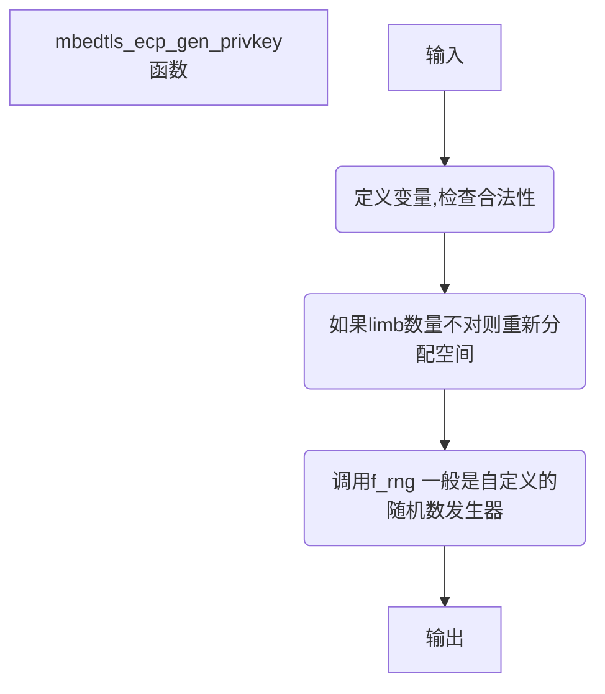

# mbedtls_mpi_fill_random(bignum.c 2121)

## 函数流程



## 函数代码

```c
*/
int mbedtls_mpi_fill_random( mbedtls_mpi *X, size_t size,
                     int (*f_rng)(void *, unsigned char *, size_t),
                     void *p_rng )
{
    int ret;
    size_t const limbs = CHARS_TO_LIMBS( size );
    size_t const overhead = ( limbs * ciL ) - size;
    unsigned char *Xp;

    MPI_VALIDATE_RET( X     != NULL );
    MPI_VALIDATE_RET( f_rng != NULL );

    /* Ensure that target MPI has exactly the necessary number of limbs */
    if( X->n != limbs )
    {
        mbedtls_mpi_free( X );
        mbedtls_mpi_init( X );
        MBEDTLS_MPI_CHK( mbedtls_mpi_grow( X, limbs ) );
    }
    MBEDTLS_MPI_CHK( mbedtls_mpi_lset( X, 0 ) );

    Xp = (unsigned char*) X->p;
    f_rng( p_rng, Xp + overhead, size );

    mpi_bigendian_to_host( X->p, limbs );

cleanup:
    return( ret );
}
```

## 函数说明

函数首先对输入参数进行验证，确保它们不为 NULL。然后，函数计算出目标大整数所需要的 limbs 数量，并分配相应的存储空间。如果目标大整数的 limbs 数量与所需的数量不同，则先释放目标大整数的存储空间，并重新分配所需的存储空间。接着，函数将目标大整数的值设置为 0。

接下来，函数生成一个随机数，并将其填充到目标大整数中。为了防止填充的随机数溢出目标大整数的位数，函数需要计算出填充随机数所需要的字节数，以及目标大整数的存储指针。随机数生成器 f_rng负责生成随机数，而指针 p_rng 则用于传递随机数生成器的上下文信息。