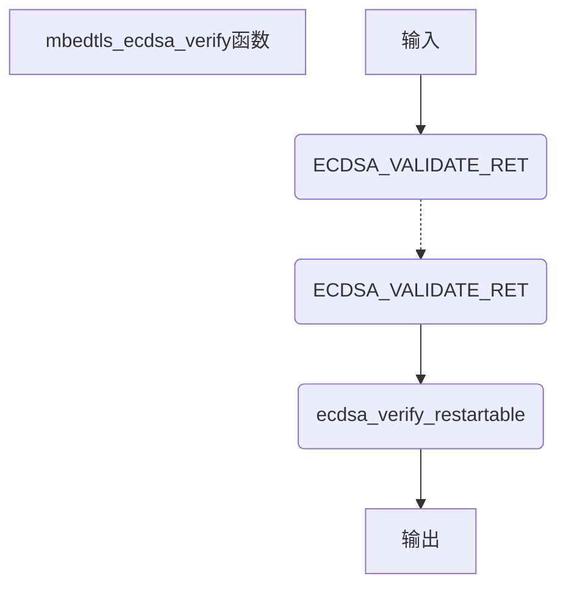

# 入口函数：mbedtls_ecdsa_verify（ecdsa.c 597）

## 函数输入

grp：椭圆曲线群指针

buf：此处输入为消息msg的哈希值

blen：哈希值长度

Q：ECDSA共公钥

r、s：用于验证的签名

## 函数输出

ret，表示验证是否通过，正确返回0，错误返回MBEDTLS_ERR_ECP_VERIFY_FAILED

## 函数流程

***点击流程图跳转对应函数***



## 函数代码

```c
int mbedtls_ecdsa_verify( mbedtls_ecp_group *grp,
                          const unsigned char *buf, size_t blen,
                          const mbedtls_ecp_point *Q,
                          const mbedtls_mpi *r,
                          const mbedtls_mpi *s)
{
    ECDSA_VALIDATE_RET( grp != NULL );
    ECDSA_VALIDATE_RET( Q   != NULL );
    ECDSA_VALIDATE_RET( r   != NULL );
    ECDSA_VALIDATE_RET( s   != NULL );
    ECDSA_VALIDATE_RET( buf != NULL || blen == 0 );

    return( ecdsa_verify_restartable( grp, buf, blen, Q, r, s, NULL ) );
}
```

## 函数说明

外层函数与签名类似，传递参数并调用核心函数ecdsa_verify_restartable