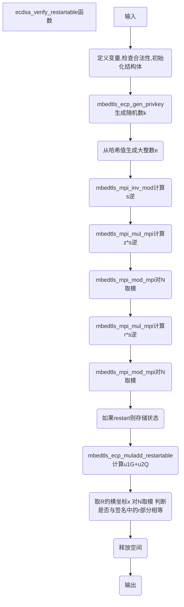

# 核心函数ecdsa_verify_restartable（ecdsa.c 489）

## 函数输入

grp：椭圆曲线群指针

buf：此处输入为消息msg的哈希值

blen：哈希值长度

Q：ECDSA共公钥

r、s：用于验证的签名

rs_ctx：restart上下文，取NULL时禁用功能

## 函数输出

ret，表示验证是否通过，正确返回0，错误返回MBEDTLS_ERR_ECP_VERIFY_FAILED

## 函数流程

***点击流程图跳转对应函数***



## 

## 函数代码

```c
static int ecdsa_verify_restartable( mbedtls_ecp_group *grp,
                                     const unsigned char *buf, size_t blen,
                                     const mbedtls_ecp_point *Q,
                                     const mbedtls_mpi *r, const mbedtls_mpi *s,
                                     mbedtls_ecdsa_restart_ctx *rs_ctx )
{
    int ret;
    mbedtls_mpi e, s_inv, u1, u2;
    mbedtls_ecp_point R;
    mbedtls_mpi *pu1 = &u1, *pu2 = &u2;

    mbedtls_ecp_point_init( &R );
    mbedtls_mpi_init( &e ); mbedtls_mpi_init( &s_inv );
    mbedtls_mpi_init( &u1 ); mbedtls_mpi_init( &u2 );

    /* Fail cleanly on curves such as Curve25519 that can't be used for ECDSA */
    if( grp->N.p == NULL )
        return( MBEDTLS_ERR_ECP_BAD_INPUT_DATA );

    ECDSA_RS_ENTER( ver );

#if defined(MBEDTLS_ECP_RESTARTABLE)
    if( rs_ctx != NULL && rs_ctx->ver != NULL )
    {
        /* redirect to our context */
        pu1 = &rs_ctx->ver->u1;
        pu2 = &rs_ctx->ver->u2;

        /* jump to current step */
        if( rs_ctx->ver->state == ecdsa_ver_muladd )
            goto muladd;
    }
#endif /* MBEDTLS_ECP_RESTARTABLE */

    /*
     * Step 1: make sure r and s are in range 1..n-1
     */
    if( mbedtls_mpi_cmp_int( r, 1 ) < 0 || mbedtls_mpi_cmp_mpi( r, &grp->N ) >= 0 ||
        mbedtls_mpi_cmp_int( s, 1 ) < 0 || mbedtls_mpi_cmp_mpi( s, &grp->N ) >= 0 )
    {
        ret = MBEDTLS_ERR_ECP_VERIFY_FAILED;
        goto cleanup;
    }

    /*
     * Step 3: derive MPI from hashed message
     */
    MBEDTLS_MPI_CHK( derive_mpi( grp, &e, buf, blen ) );

    /*
     * Step 4: u1 = e / s mod n, u2 = r / s mod n
     */
    ECDSA_BUDGET( MBEDTLS_ECP_OPS_CHK + MBEDTLS_ECP_OPS_INV + 2 );

    MBEDTLS_MPI_CHK( mbedtls_mpi_inv_mod( &s_inv, s, &grp->N ) );

    MBEDTLS_MPI_CHK( mbedtls_mpi_mul_mpi( pu1, &e, &s_inv ) );
    MBEDTLS_MPI_CHK( mbedtls_mpi_mod_mpi( pu1, pu1, &grp->N ) );

    MBEDTLS_MPI_CHK( mbedtls_mpi_mul_mpi( pu2, r, &s_inv ) );
    MBEDTLS_MPI_CHK( mbedtls_mpi_mod_mpi( pu2, pu2, &grp->N ) );

#if defined(MBEDTLS_ECP_RESTARTABLE)
    if( rs_ctx != NULL && rs_ctx->ver != NULL )
        rs_ctx->ver->state = ecdsa_ver_muladd;

muladd:
#endif
    /*
     * Step 5: R = u1 G + u2 Q
     */
    MBEDTLS_MPI_CHK( mbedtls_ecp_muladd_restartable( grp,
                     &R, pu1, &grp->G, pu2, Q, ECDSA_RS_ECP ) );

    if( mbedtls_ecp_is_zero( &R ) )
    {
        ret = MBEDTLS_ERR_ECP_VERIFY_FAILED;
        goto cleanup;
    }

    /*
     * Step 6: convert xR to an integer (no-op)
     * Step 7: reduce xR mod n (gives v)
     */
    MBEDTLS_MPI_CHK( mbedtls_mpi_mod_mpi( &R.X, &R.X, &grp->N ) );

    /*
     * Step 8: check if v (that is, R.X) is equal to r
     */
    if( mbedtls_mpi_cmp_mpi( &R.X, r ) != 0 )
    {
        ret = MBEDTLS_ERR_ECP_VERIFY_FAILED;
        goto cleanup;
    }

cleanup:
    mbedtls_ecp_point_free( &R );
    mbedtls_mpi_free( &e ); mbedtls_mpi_free( &s_inv );
    mbedtls_mpi_free( &u1 ); mbedtls_mpi_free( &u2 );

    ECDSA_RS_LEAVE( ver );

    return( ret );
}
```


## 函数说明

进行ECDSA验签

**对照ECDSA验签流程：**

签名r，s   公钥Q

**第一步**，计算z=H(msg)

**第二步**，计算u1=zs^-1 (mod N), u2=rs^-1 (mod N)

**第三步**，计算点R=u1 G+u2 Q

**第四步**，验证R.x是否等于r(mod N)


**代码分析：顺序分析函数功能**

```c
    int ret;
    mbedtls_mpi e, s_inv, u1, u2;
    mbedtls_ecp_point R;
    mbedtls_mpi *pu1 = &u1, *pu2 = &u2;
```

定义变量，u1 u2 R与上面步骤中的u1 u2 R对应，ret用于存储结果，s_inv存储s^-1的值，e存储哈希生成的大整数

```c
    mbedtls_ecp_point_init( &R );
    mbedtls_mpi_init( &e ); mbedtls_mpi_init( &s_inv );
    mbedtls_mpi_init( &u1 ); mbedtls_mpi_init( &u2 );

    /* Fail cleanly on curves such as Curve25519 that can't be used for ECDSA */
    if( grp->N.p == NULL )
        return( MBEDTLS_ERR_ECP_BAD_INPUT_DATA );
```

初始化结构体并检查合法性（判断N是否为空）

```c
    ECDSA_RS_ENTER( ver );

#if defined(MBEDTLS_ECP_RESTARTABLE)
    if( rs_ctx != NULL && rs_ctx->ver != NULL )
    {
        /* redirect to our context */
        pu1 = &rs_ctx->ver->u1;
        pu2 = &rs_ctx->ver->u2;

        /* jump to current step */
        if( rs_ctx->ver->state == ecdsa_ver_muladd )
            goto muladd;
    }
#endif /* MBEDTLS_ECP_RESTARTABLE */
```

类似地，如果开启了restart模式，为u1 u2赋值并跳转到对应的位置继续执行

```c
    if( mbedtls_mpi_cmp_int( r, 1 ) < 0 || mbedtls_mpi_cmp_mpi( r, &grp->N ) >= 0 ||
        mbedtls_mpi_cmp_int( s, 1 ) < 0 || mbedtls_mpi_cmp_mpi( s, &grp->N ) >= 0 )
    {
        ret = MBEDTLS_ERR_ECP_VERIFY_FAILED;
        goto cleanup;
    }
```

检查签名（r,s）是否合理，判断是否在1到n-1的范围内

```c
MBEDTLS_MPI_CHK( derive_mpi( grp, &e, buf, blen ) );
```

从哈希值buf生成对应的大整数e

```c
    MBEDTLS_MPI_CHK( mbedtls_mpi_inv_mod( &s_inv, s, &grp->N ) );

    MBEDTLS_MPI_CHK( mbedtls_mpi_mul_mpi( pu1, &e, &s_inv ) );
    MBEDTLS_MPI_CHK( mbedtls_mpi_mod_mpi( pu1, pu1, &grp->N ) );

    MBEDTLS_MPI_CHK( mbedtls_mpi_mul_mpi( pu2, r, &s_inv ) );
    MBEDTLS_MPI_CHK( mbedtls_mpi_mod_mpi( pu2, pu2, &grp->N ) );
```

与上面的流程对应，计算u1=zs^-1 (mod N), u2=rs^-1 (mod N)

```c
#if defined(MBEDTLS_ECP_RESTARTABLE)
    if( rs_ctx != NULL && rs_ctx->ver != NULL )
        rs_ctx->ver->state = ecdsa_ver_muladd;

muladd:
#endif
```

这里如果开启了restart模式，则进行状态存储rs_ctx->ver->state = ecdsa_ver_muladd，同时断点继续执行时也从这一句下面的muladd：后开始执行

```c
    MBEDTLS_MPI_CHK( mbedtls_ecp_muladd_restartable( grp,
                     &R, pu1, &grp->G, pu2, Q, ECDSA_RS_ECP ) );
```

 使用mbedtls_ecp_muladd_restartable函数计算R = u1 G + u2 Q

```c
    if( mbedtls_ecp_is_zero( &R ) )
    {
        ret = MBEDTLS_ERR_ECP_VERIFY_FAILED;
        goto cleanup;
    }

    MBEDTLS_MPI_CHK( mbedtls_mpi_mod_mpi( &R.X, &R.X, &grp->N ) );

    if( mbedtls_mpi_cmp_mpi( &R.X, r ) != 0 )
    {
        ret = MBEDTLS_ERR_ECP_VERIFY_FAILED;
        goto cleanup;
    }
```

先判断计算得到的点R是否为零，如果为零则失败。

之后取R的横坐标x，对N取模，判断是否与签名中的r部分相等，如果相等则验签通过

```c
cleanup:
    mbedtls_ecp_point_free( &R );
    mbedtls_mpi_free( &e ); mbedtls_mpi_free( &s_inv );
    mbedtls_mpi_free( &u1 ); mbedtls_mpi_free( &u2 );

    ECDSA_RS_LEAVE( ver );

    return( ret );
```

最后释放空间并返回

